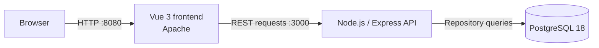

# ESG Risk Analytics Platform

[](https://github.com/a25618665/ESG-project/actions/workflows/ci.yml)

A containerized three-tier platform for presenting structured company and ESG risk data through a Vue interface, an Express API, and PostgreSQL. The repository combines the application source, automated verification, research data, and supporting project reports from a university capstone project.


_Company-record interface using the two illustrative records from `database/init/`; these records are not part of the research dataset._

## Engineering highlights

- **Three-service architecture:** packages the Vue/Apache frontend, Node.js/Express API, and PostgreSQL database as independently built services with health checks and dependency-aware startup.
- **Modern frontend delivery:** replaces the legacy Vue CLI/Webpack build with Vite, reducing frontend lockfile dependency entries from 1,383 to 171—including component-test tooling—and producing a clean npm audit.
- **Layered backend:** separates routing, controllers, services, repositories, database configuration, and error handling while preserving the original `/company` response for backward compatibility.
- **Hardened dependency boundaries:** runs Express 5 and pg-promise 12 with test tools isolated in `devDependencies`, unused middleware removed, and zero backend npm audit findings.
- **Source-backed data pipeline:** transforms 188 populated workbook events into normalized PostgreSQL records for 33 companies and 11 risk categories while retaining source-row provenance and excluding republished news text.
- **Indexed exploration API:** provides server-side filtering by CCRI grade, major risk class, and six-digit company code with parameterized SQL, deterministic ordering, bounded pagination, and structured validation errors.
- **Automated verification:** runs two dependency audits, 32 backend tests, 16 Vue component tests, a production frontend build, Docker image builds, and a full-stack data-integrity smoke test on every pull request and push to `main` through GitHub Actions.
- **Structured research scale:** serves 188 CCRI risk events from 33 companies across 3 risk classes, 11 subcategories, and 7 numeric grades, explicitly accounting for 26 additional `D`-coded records, alongside the documented 311 company-report pairs.

## Architecture



The API uses dependency injection between its service and repository layers, which keeps database access replaceable during tests. Docker Compose waits for database and API health checks before starting dependent services.

## Technology

| Area | Technology |
| --- | --- |
| Frontend | JavaScript, Vue 3, Vite, Axios, Apache HTTP Server |
| Backend | Node.js, Express, pg-promise |
| Database | PostgreSQL 18, SQL initialization scripts |
| Testing | Mocha, Supertest, Vitest, Vue Test Utils |
| Delivery | Docker, Docker Compose, GitHub Actions |

## API

| Method | Path | Purpose |
| --- | --- | --- |
| `GET` | `/` | Lists the public API endpoints |
| `GET` | `/health` | Reports API health |
| `GET` | `/api/companies` | Returns `{ data, meta: { count } }` |
| `GET` | `/api/risk-summary` | Returns verified CCRI metrics and distributions |
| `GET` | `/api/risk-events` | Filters and paginates normalized risk-event records |
| `GET` | `/company` | Preserves the original array response |

Unknown routes and database failures return consistent JSON errors without exposing internal implementation details. CORS is restricted to the configured frontend origin.

`/api/risk-events` accepts optional `grade`, `majorClass`, and `companyCode` filters plus `limit` (1–100) and `offset` (0–10,000). Unsupported or malformed query parameters return `400 INVALID_QUERY_PARAMETER`; all SQL values remain parameterized.

## Run with Docker

Prerequisites: Docker Desktop with Docker Compose.

```bash
git clone https://github.com/a25618665/ESG-project.git
cd ESG-project
docker compose up --build
```

Open:

- Frontend: <http://localhost:8080>
- API documentation response: <http://localhost:3000>
- Health check: <http://localhost:3000/health>

The default Compose credentials are intended only for local development. To override them, copy `.env.example` to `.env` and replace its placeholder values before starting the services.

Stop the services without deleting the database volume:

```bash
docker compose down
```

## Test and build

Run the backend suite:

```bash
cd backend
npm ci
npm test
```

Test and build the frontend:

```bash
cd frontend
npm ci
npm test
npm run build
```

The CI workflow repeats all 48 tests in a clean Node.js 24 environment, builds the frontend and both application images, starts the complete Compose stack, validates three API contracts, reconciles the risk distributions to 188 events, verifies filtered pagination against 17 matching records, and confirms the frontend is reachable.

## Data and research artifacts

- `data/` contains the original CCRI risk workbook used by the project.
- `docs/reports/` contains the capstone reports supporting the research scope and data counts.
- `database/init/` contains the normalized research schema, a derived 188-event analytical seed, and two clearly labeled illustrative company records retained for backward compatibility.

The derived seed retains company identity, event date and code, CCRI grade and period, category relationships, and the original worksheet row. Full news text is intentionally excluded. PostgreSQL constraints enforce the source's identifier, grade, period, foreign-key, and uniqueness rules.

## Repository structure

```text
.
├── backend/              Express API, layered application code, and tests
├── database/init/        PostgreSQL schema and local sample records
├── data/                 CCRI research workbook
├── docs/                 Reports and project images
├── frontend/             Vue interface and production container
├── .github/workflows/    Continuous-integration workflow
└── compose.yaml          Three-service local environment
```

## Security notes

- Runtime credentials are read from environment variables and are excluded from Git.
- `.env.example` contains placeholders only and is safe to copy for local setup.
- Production deployments should use a secrets manager, a restricted database account, TLS, and an explicit production CORS origin.
