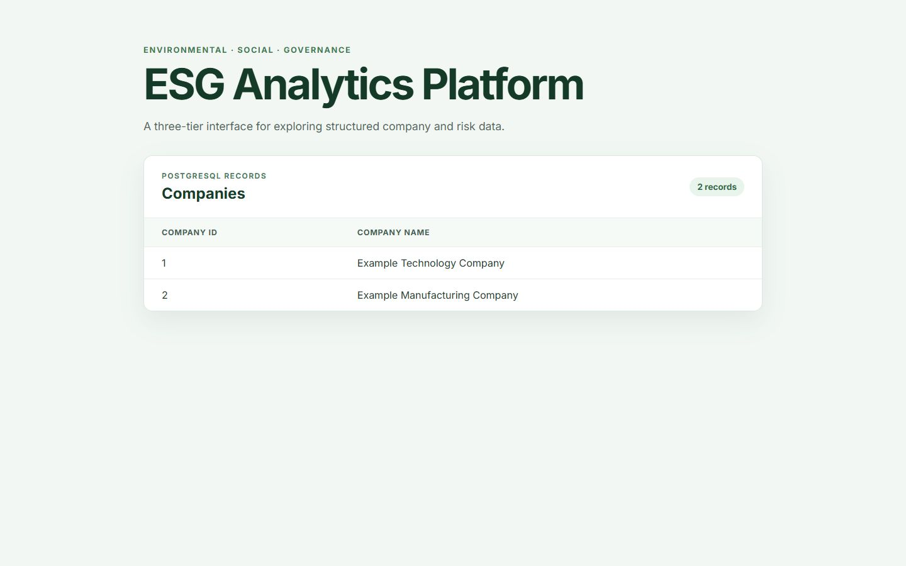
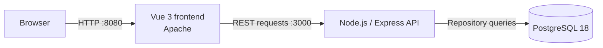

# ESG Risk Analytics Platform

[](https://github.com/a25618665/ESG-project/actions/workflows/ci.yml)

A containerized three-tier platform for presenting structured company and ESG risk data through a Vue interface, an Express API, and PostgreSQL. The repository combines the application source, automated verification, research data, and supporting project reports from a university capstone project.



_Local application preview using the two illustrative records from `database/init/`; these records are not part of the research dataset._

## Engineering highlights

- **Three-service architecture:** packages the Vue/Apache frontend, Node.js/Express API, and PostgreSQL database as independently built services with health checks and dependency-aware startup.
- **Layered backend:** separates routing, controllers, services, repositories, database configuration, and error handling while preserving the original `/company` response for backward compatibility.
- **Automated verification:** runs 18 backend tests, a production frontend build, and Docker image builds on every pull request and push to `main` through GitHub Actions.
- **Structured research scale:** documents 188 CCRI risk events from 33 companies using 7 fields, 3 risk classes, 11 subcategories, and 7 grades, together with 311 company-report pairs.

## Architecture



The API uses dependency injection between its service and repository layers, which keeps database access replaceable during tests. Docker Compose waits for database and API health checks before starting dependent services.

## Technology

| Area | Technology |
| --- | --- |
| Frontend | JavaScript, Vue 3, Axios, Apache HTTP Server |
| Backend | Node.js, Express, pg-promise |
| Database | PostgreSQL 18, SQL initialization scripts |
| Testing | Mocha, Supertest |
| Delivery | Docker, Docker Compose, GitHub Actions |

## API

| Method | Path | Purpose |
| --- | --- | --- |
| `GET` | `/` | Lists the public API endpoints |
| `GET` | `/health` | Reports API health |
| `GET` | `/api/companies` | Returns `{ data, meta: { count } }` |
| `GET` | `/company` | Preserves the original array response |

Unknown routes and database failures return consistent JSON errors without exposing internal implementation details. CORS is restricted to the configured frontend origin.

## Run with Docker

Prerequisites: Docker Desktop with Docker Compose.

```bash
git clone https://github.com/a25618665/ESG-project.git
cd ESG-project
docker compose up --build
```

Open:

- Frontend: <http://localhost:8080>
- API documentation response: <http://localhost:3000>
- Health check: <http://localhost:3000/health>

The default Compose credentials are intended only for local development. To override them, copy `.env.example` to `.env` and replace its placeholder values before starting the services.

Stop the services without deleting the database volume:

```bash
docker compose down
```

## Test and build

Run the backend suite:

```bash
cd backend
npm ci
npm test
```

Build the frontend:

macOS or Linux:

```bash
cd frontend
npm ci
NODE_OPTIONS=--openssl-legacy-provider npm run build
```

Windows PowerShell:

```powershell
cd frontend
npm ci
$env:NODE_OPTIONS="--openssl-legacy-provider"
npm run build
```

The CI workflow repeats both checks in a clean Node.js 24 environment and then builds the backend and frontend container images.

## Data and research artifacts

- `data/` contains the CCRI risk workbook used by the project.
- `docs/reports/` contains the capstone reports supporting the research scope and data counts.
- `database/init/` contains a minimal schema and two clearly labeled illustrative records for local application startup; these examples are not the research dataset.

The research model organizes each observed risk event by company, event information, risk classification, and CCRI grade to support trend and composition analysis.

## Repository structure

```text
.
├── backend/              Express API, layered application code, and tests
├── database/init/        PostgreSQL schema and local sample records
├── data/                 CCRI research workbook
├── docs/                 Reports and project images
├── frontend/             Vue interface and production container
├── .github/workflows/    Continuous-integration workflow
└── compose.yaml          Three-service local environment
```

## Security notes

- Runtime credentials are read from environment variables and are excluded from Git.
- `.env.example` contains placeholders only and is safe to copy for local setup.
- Production deployments should use a secrets manager, a restricted database account, TLS, and an explicit production CORS origin.
