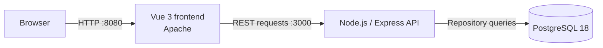

# ESG Risk Analytics Platform

[](https://github.com/a25618665/ESG-project/actions/workflows/ci.yml)

A containerized three-tier platform for presenting structured company and ESG risk data through a Vue interface, an Express API, and PostgreSQL. The repository combines the application source, automated verification, research data, and supporting project reports from a university capstone project.


_Company-record interface using the two illustrative records from `database/init/`; these records are not part of the research dataset._

## Engineering highlights

- **Three-service architecture:** packages the Vue/Apache frontend, Node.js/Express API, and PostgreSQL database as independently built services with liveness, database-backed readiness, dependency-aware startup, and bounded graceful shutdown.
- **Modern frontend delivery:** replaces the legacy Vue CLI/Webpack build with Vite, reducing frontend lockfile dependency entries from 1,383 to 171—including component-test tooling—and producing a clean npm audit.
- **Layered backend:** separates routing, controllers, services, repositories, database configuration, and error handling while preserving the original `/company` response for backward compatibility.
- **Machine-readable API contract:** publishes an OpenAPI 3.1 specification for all 8 public and compatibility routes, including bounded filters, response schemas, structured errors, and explicit deprecation metadata.
- **Dependency-aware reliability:** separates process liveness from PostgreSQL readiness, converts dependency failures into safe `503 SERVICE_NOT_READY` responses, and prevents downstream containers from starting before the API can query its database.
- **Versioned database changes:** applies 5 ordered SQL migrations under an advisory lock, records SHA-256 checksums in a migration ledger, rejects historical drift, and verifies idempotent startup against an existing PostgreSQL volume.
- **End-to-end request tracing:** generates correlation IDs in the browser, validates and propagates `X-Request-Id` across all 8 routes, emits structured completion logs without query parameters, and displays returned references on client errors for browser-to-server diagnosis.
- **Resilient data interface:** centralizes API configuration with an 8-second timeout, exposes accessible retry actions for all 3 data views, and cancels or ignores stale explorer requests so older responses cannot overwrite newer filters.
- **Deploy-safe lifecycle:** handles `SIGTERM` and `SIGINT` idempotently, stops accepting new traffic, drains active HTTP requests, closes idle connections and the PostgreSQL pool, and enforces a 10-second forced-shutdown limit with structured lifecycle events.
- **Hardened HTTP boundary:** removes framework fingerprinting, sets explicit content, frame, referrer, and browser-permission policies, limits bodies to 16 KB and forms to 50 fields, and excludes query strings from 404 errors and request logs.
- **Hardened dependency boundaries:** runs Express 5 and pg-promise 12 with test tools isolated in `devDependencies`, unused middleware removed, and zero backend npm audit findings.
- **Source-backed data pipeline:** transforms 188 populated workbook events into normalized PostgreSQL records for 33 companies and 11 risk categories while retaining source-row provenance and excluding republished news text.
- **Indexed exploration API:** provides server-side filtering by CCRI grade, major risk class, and six-digit company code with parameterized SQL, deterministic ordering, bounded pagination, and structured validation errors.
- **Automated verification:** runs two dependency audits, 72 backend tests, 25 frontend client/component tests, 8 data-pipeline tests, deterministic seed-drift detection, a production frontend build, Docker image builds, persistent-volume migration verification, a full-stack data-integrity smoke test, and a real container-shutdown check on every pull request and push to `main` through GitHub Actions.
- **Structured research scale:** serves 188 CCRI risk events from 33 companies across 3 risk classes, 11 subcategories, and 7 numeric grades, explicitly accounting for 26 additional `D`-coded records, alongside the documented 311 company-report pairs.

## Architecture



The API uses dependency injection between its service and repository layers, which keeps database access replaceable during tests. Before accepting traffic, the backend serializes migration startup with a PostgreSQL advisory lock, verifies the recorded migration checksums, and applies each pending migration transactionally. Docker Compose waits for PostgreSQL health and database-backed API readiness before starting dependent services, then gives the backend 15 seconds to complete its bounded shutdown sequence.

## Technology

| Area | Technology |
| --- | --- |
| Frontend | JavaScript, Vue 3, Vite, Axios, Apache HTTP Server |
| Backend | Node.js, Express, pg-promise |
| Database | PostgreSQL 18, SQL initialization scripts |
| Testing | Mocha, Supertest, Vitest, Vue Test Utils |
| Delivery | Docker, Docker Compose, GitHub Actions |

## API

| Method | Path | Purpose |
| --- | --- | --- |
| `GET` | `/` | Lists the public API endpoints |
| `GET` | `/health` | Reports process liveness |
| `GET` | `/ready` | Verifies API and PostgreSQL readiness |
| `GET` | `/openapi.json` | Serves the OpenAPI 3.1 contract |
| `GET` | `/api/companies` | Returns `{ data, meta: { count } }` |
| `GET` | `/api/risk-summary` | Returns verified CCRI metrics and distributions |
| `GET` | `/api/risk-events` | Filters and paginates normalized risk-event records |
| `GET` | `/company` | Preserves the original array response |

Every route accepts an optional `X-Request-Id` correlation header and returns a validated identifier in the response. The shared frontend client generates this identifier for every API request and surfaces the returned reference when a request fails. Structured completion logs record that identifier, method, path, status, duration, and error code without retaining query parameters. Unknown routes and database failures return the same identifier in consistent JSON errors without exposing internal implementation details. CORS is restricted to the configured frontend origin.

The complete request, response, validation, and error schemas are available in the [OpenAPI 3.1 contract](backend/openapi.json) and from the running service at <http://localhost:3000/openapi.json>.

`/api/risk-events` accepts optional `grade`, `majorClass`, and `companyCode` filters plus `limit` (1–100) and `offset` (0–10,000). Unsupported or malformed query parameters return `400 INVALID_QUERY_PARAMETER`; all SQL values remain parameterized.

## Run with Docker

Prerequisites: Docker Desktop with Docker Compose.

```bash
git clone https://github.com/a25618665/ESG-project.git
cd ESG-project
docker compose up --build
```

Open:

- Frontend: <http://localhost:8080>
- API documentation response: <http://localhost:3000>
- Liveness check: <http://localhost:3000/health>
- Database-backed readiness check: <http://localhost:3000/ready>

The default Compose credentials are intended only for local development. To override them, copy `.env.example` to `.env` and replace its placeholder values before starting the services.

Stop the services without deleting the database volume:

```bash
docker compose down
```

## Test and build

Run the backend suite:

```bash
cd backend
npm ci
npm test
```

Test and build the frontend:

```bash
cd frontend
npm ci
npm test
npm run build
```

The CI workflow runs all 105 tests in clean Node.js 24 and Python 3.13 environments, verifies that the committed SQL can be reproduced from the workbook, builds the frontend and both application images, starts the complete Compose stack, validates liveness, database readiness, request-ID propagation, browser security headers, and four data/API contracts, reconciles the risk distributions to 188 events, verifies filtered pagination against 17 matching records, confirms the frontend is reachable, restarts the backend against the same PostgreSQL volume to prove all 5 migrations are skipped safely, and verifies that HTTP connections and the PostgreSQL pool close cleanly after Docker sends `SIGTERM`.

## Data and research artifacts

- `data/` contains the original CCRI risk workbook used by the project.
- `docs/reports/` contains the capstone reports supporting the research scope and data counts.
- `database/init/` contains the normalized research schema, a derived 188-event analytical seed, and two clearly labeled illustrative company records retained for backward compatibility.

The derived seed retains company identity, event date and code, CCRI grade and period, category relationships, and the original worksheet row. Full news text is intentionally excluded. PostgreSQL constraints enforce the source's identifier, grade, period, foreign-key, and uniqueness rules.

The five ordered files in `database/init/` serve both as first-volume initialization and versioned migrations. On every backend startup, a `schema_migrations` ledger records each filename and SHA-256 checksum. Applied files are immutable: create the next numbered SQL file for schema or data changes instead of editing recorded history. For a deliberate research-data revision, generate SQL to a temporary `--output` path and review it into a new migration.

Regenerate and verify the analytical seed:

```bash
python -m pip install --requirement requirements-dev.txt
python tools/generate_risk_seed.py
python tools/generate_risk_seed.py --check
```

The generator validates the seven-column source layout while intentionally skipping each news-text cell, checks the workbook contract and verified distributions, and emits deterministic SQL. The `--check` option compares fresh output with the committed seed without modifying it, which lets CI detect unreviewed data drift.

## Repository structure

```text
.
├── backend/              Express API, layered application code, and tests
├── database/init/        Ordered PostgreSQL schema and data migrations
├── data/                 CCRI research workbook
├── docs/                 Reports and project images
├── frontend/             Vue interface and production container
├── tools/                Deterministic workbook-to-SQL generator and tests
├── .github/workflows/    Continuous-integration workflow
└── compose.yaml          Three-service local environment
```

## Security notes

- Runtime credentials are read from environment variables and are excluded from Git.
- `.env.example` contains placeholders only and is safe to copy for local setup.
- Production deployments should use a secrets manager, a restricted database account, TLS, and an explicit production CORS origin.
